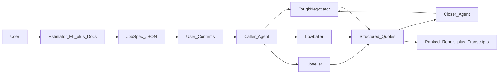

# FairMove — The Negotiator (HackNation 24h Plan)

## Verdict from the brief + your last hackathon

You lost selection last time with a strong *idea* that overlapped winners, not because the problem was wrong. Winners (Neo Command / Virtue IDP / MedDesert) presented a **closed, judge-legible loop** with clear artifacts. This challenge’s own rubric says it is won in **call design + closed loop**, not model architecture.

**Winning posture for Challenge 01:**
- Prove the brief’s success checklist line-by-line in a 2–3 min demo
- Show a **price actually moving** mid-call because of real competing quotes (not a scripted TTS play)
- Be honest on AI disclosure / no fake bids (weak submissions “bluff”)
- Ship **one vertical end-to-end**; moving is already documented with the 5.6x / FMCSA / BBB numbers judges expect

**Do not fork** [HelloAlex_BE](D:\HelloAlex_BE) or [HelloAlexAI](D:\HelloAlexAI). They are multi-tenant production systems. **Copy patterns only**, especially ElevenLabs outbound + dynamic variables from [`qaElevenLabsCaller.ts`](D:\HelloAlexAI\server\services\qaElevenLabsCaller.ts) (`/v1/convai/twilio/outbound_call`, prompt via `dynamic_variables`) and agent create from [`elevenLabsConvAI.ts`](D:\HelloAlexAI\server\services\elevenLabsConvAI.ts).

---

## Locked product decisions (solo / ~19h to 9AM ET)

| Decision | Choice | Why |
|---|---|---|
| Vertical | Residential local move (Rock Hill → Charlotte, 45 mi) | Brief’s canonical numbers; zero research tax |
| Product name | **FairMove** | Clear consumer pitch; “never overpay again” |
| Counterparty | **3 ElevenLabs counter-agents** (agent-to-agent) | Allowed by brief; demo-reliable for solo; 3 distinct styles |
| Real Twilio PSTN | Stretch only | Needs provisioned EL phone_number_id; don’t block MVP |
| UI | Lovable-built dashboard + your Next/API orchestration | Credits buy polish for jury; you own the voice brain |
| Vertical switch | `verticals/moving.json` config | Satisfies “config not code” without second vertical |

**Three counterparty personas (mandatory distinct styles):**
1. **ToughNegotiator** — highball, resists discount, yields only to written competing quote
2. **Lowballer** — suspiciously cheap base + stairs/long-carry/fuel add-ons (red-flag demo)
3. **Upseller** — mid quote + hard sell on packing/insurance/weekend surcharge

---

## Architecture (closed loop)

**Stack (greenfield under `D:\HackNation\fairmove`):**
- **Next.js 14** API + thin UI shell (or Lovable UI talking to your API)
- **ElevenLabs Agents** — Estimator (browser widget), Caller, Closer, 3 counter-agents
- **Claude / OpenAI** — document → JobSpec, transcript → itemised quote JSON, red-flag scoring
- **Tavily** — “find movers near ZIP” for call-list provenance
- **SQLite or JSON file store** — jobs, quotes, recordings metadata (no Postgres tax)
- Seed call list from brief + 3–5 fake Charlotte movers with ratings (show Places-shaped schema)

Reuse conceptually from HelloAlex:
- Create agent once, override prompt/first message per call via `dynamic_variables`
- Receive ElevenLabs post-call webhook, then poll as a fallback
- Normalize transcript, recording, status, and structured outcomes
- Correlate calls by `conversation_id` with idempotent persistence
- Client tools mid-call: `log_quote_line_item`, `get_competing_quotes`, `flag_red_flag`

---

## Mandatory modules (map 1:1 to brief)

### 01 Estimator — Intake
- **Voice interview** on ElevenLabs Agents (widget in UI): rooms, large items, stairs/elevator, packing, dates, origin/destination, access constraints
- **Document path**: upload inventory PDF / existing quote photo → vision/OCR → same JobSpec
- User **confirms/edits** JobSpec JSON before any outbound
- Schema example fields: `origin`, `destination`, `miles`, `bedrooms`, `inventory[]`, `stairs`, `elevator`, `packing`, `moveDate`, `accessNotes`

### 02 Caller — Parallel quote gathering
- Inject **identical JobSpec** into every call
- Run 3 sessions (parallel or sequential for demo clarity) against counter-agents
- Each call ends as: itemised quote | callback | documented decline
- Store: recording URL, transcript, structured fees (`base`, `stairs`, `longCarry`, `fuel`, `packing`, `total`)

### 03 Closer — Negotiate + report
- Pick best legitimate competitor (not the 30%+ below-market lowball)
- Second call to ToughNegotiator or Upseller with **real leverage**: “I have a binding itemised quote for $X from Company Y — can you match/beat?”
- Demo must show **price or terms change** on the recording
- Final UI: ranked table, red flags, recommended deal, cite transcript snippets + play clips

**Honesty / conversation requirements (surface in tech video):**
- Disclose AI when asked; never invent inventory or fake bids
- Only cite quotes that exist in DB
- Handle “we don’t quote by phone” → structured decline

---

## 19-hour execution schedule

| Block | Hours | Deliverable |
|---|---|---|
| A | 0–2 | Repo scaffold, JobSpec schema, `moving.json` benchmarks/red-flag rules, agent prompt drafts |
| B | 2–6 | Estimator voice widget + document upload → confirmed JobSpec |
| C | 6–11 | 3 counter-agents + Caller + quote extraction tools + store |
| D | 11–14 | Closer negotiation pass + ranked report UI |
| E | 14–16 | Golden demo path rehearsed; fix friction; record best negotiation clip |
| F | 16–19 | Demo / tech / team videos, 150–300 word summary, GitHub README, submit |

**Cut list if behind:** skip real Twilio; skip Tavily live search; sequential calls instead of parallel; Lovable UI can be a single “Mission Control” page.

**Never cut:** confirmed JobSpec reused verbatim; 3 styles; one live price move; ranked report with transcript evidence.

---

## Jury narrative (how you get selected this time)

Last time: similar idea to winners, weak selection surface. This time the submission *is* the checklist:

1. **Demo video (primary):** One continuous user journey — Daniel’s move → voice+doc intake → confirm spec → 3 live calls (play audio) → negotiation where price moves → ranked recommendation with citations. Open with the 5.6x spread line from the brief.
2. **Tech video:** Estimator/Caller/Closer + config vertical + tools that prevent bluffing + HelloAlex-inspired EL dispatch pattern (without claiming you forked it).
3. **Team video:** Solo builder; voice-AI background via HelloAlex/Bland/Twilio experience; why moving; why honesty constraints.
4. **Summary (150–300 words):** Problem → FairMove loop → proof (price moved) → generalizes via config.

---

## Credits requests

### Lovable

**1. What is the core vision and goal of your project?**

FairMove is a consumer voice-AI negotiator that protects people from opaque and unreliable moving quotes. It builds one verified move specification, calls several movers with exactly the same requirements, captures itemised quotes, negotiates using truthful competing offers, and returns an evidence-backed recommendation with recordings and transcript citations.

**2. How exactly do you plan to integrate this specific API into your technical solution?**

Lovable will power FairMove’s customer-facing Mission Control: the intake and specification confirmation experience, live call status board, itemised quote comparison, red-flag warnings, negotiation timeline, and recording/transcript evidence viewer. It will connect to a Next.js backend that orchestrates ElevenLabs voice agents and stores structured call outcomes.

**3. How will these credits specifically help you achieve a better result during the hackathon?**

The credits will let a solo developer deliver a polished, responsive product experience within 24 hours instead of spending most of the hackathon on UI scaffolding. This makes the complete intake-to-negotiation loop immediately understandable to judges and leaves more time to improve real conversation quality, reliability, and the live demonstration.

**Additional context**

FairMove is being built for HackNation’s ElevenLabs “The Negotiator” challenge. The MVP must demonstrate voice and document intake, three distinct quote calls, a real negotiation where price or terms change, and a ranked report backed by recordings and transcripts.

### Other credits

- **OpenAI:** Vision/OCR for document intake and structured quote extraction from transcripts
- **Tavily:** Build the real-world mover call list from location and service criteria
- **Wozcode / Emdash:** Secondary tooling only; not on the critical path

---

## Success criteria self-check

- [ ] Intake: ElevenLabs voice interview **and** one document type → same JobSpec, user-confirmed
- [ ] Calls: at least 3 distinct negotiation styles, itemised comparable quotes
- [ ] Negotiation: price/terms change on recording due to real leverage
- [ ] AI disclosure + no invented bids
- [ ] Every call → structured outcome
- [ ] Ranked report cites transcripts/recordings
- [ ] Videos + GitHub + 150–300 word summary ready by 9AM ET

## Implementation checklist

- [ ] Create FairMove Next.js repo, JobSpec schema, moving config, prompts, and storage
- [ ] Build ElevenLabs voice interview and document intake
- [ ] Build three counter-agents and quote gathering
- [ ] Add post-call webhook with polling fallback
- [ ] Build negotiation pass using persisted competing quotes
- [ ] Build Mission Control comparison and evidence UI
- [ ] Rehearse and record the golden demo path
- [ ] Prepare project summary, demo video, tech video, team video, README, and submission
