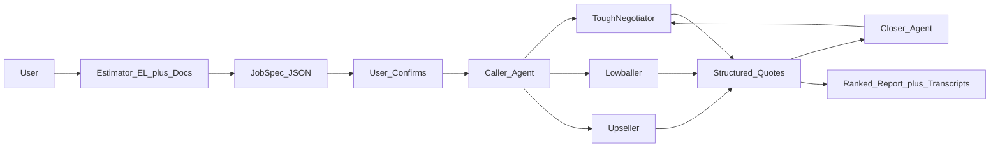

# FairMove — "The Negotiator"

**HackNation AI Hackathon · Challenge 01 (ElevenLabs: The Negotiator)**
Voice AI agents that **Call, Compare, and Haggle** in the residential moving market.
Solo build.

---

## 1. Project Summary

Moving quotes for one identical job — Rock Hill to Charlotte, 45 miles, a two-bedroom — range from **$1,158 to $6,506**. That's a **5.6x spread** for the same work, and consumers overpay because the only way to find the fair price is to call a dozen companies and describe your apartment identically every time. Almost nobody does.

FairMove closes that loop with three voice agents. The **Estimator** — an ElevenLabs conversational agent in the browser, plus photo/document OCR — interviews the customer and builds one structured, user-confirmed **JobSpec**. The **Caller** injects that *identical* spec into calls to three counterparties with distinct negotiation styles: a tough highballer who resists discounts, a lowballer whose cheap base hides stairs, long-carry and fuel add-ons, and an upseller pushing packing and insurance. Each call ends as an itemized quote, a callback, or a documented decline. The **Closer** then negotiates with real leverage — *"I have a binding itemized quote for $3,191 from Ironclad; match or beat it?"* — and the price actually **moves on the recording**, bounded by a computed cost floor rather than a scripted line.

The proof point is honesty. The agent discloses it's AI the moment it's asked, never invents inventory, and can only cite quotes that exist in the store — an invented competitor has no record to come from. FairMove then produces a ranked report where cheapest doesn't win, citing transcript snippets and playable audio for every claim. Swapping movers for auto-body shops or contractors is a single JSON config file, not a rewrite.

*(Word count: 247 — within the 150–300 range.)*

### Numbers to have on screen and memorized

| Metric | Value |
|---|---|
| Market spread (identical job) | **$1,158 – $6,506 (5.6x)** |
| FairMove benchmark for this job | **$2,852** |
| Lowballer headline → real total | **$1,127 → $1,475** |
| Negotiation (Closer) | **$3,394 → $3,191** (−$203) + 3 terms won |
| Leverage cited | Ironclad's real itemized **$3,191** |
| Outcomes | **4 quotes, 1 callback, 0 vague** |

---

## 2. Demo Video Script (2–3 min)

**Goal:** one continuous user journey with no dead air. The single most important beat is showing a **price change on a recording**. Run locally in simulation mode (no API keys needed); the header reads *"Simulated market"* — say that out loud, don't hide it.

**Setup before recording:** `npm run reset` then `npm run dev` → open `http://localhost:3000`. Keep a second terminal on `npm run demo` as a backup. Job on screen: **Daniel, Rock Hill → Charlotte, 45 mi, 2BR** (`job_daniel_rockhill`).

---

### Scene 1 — Hook on the number (0:00–0:20 · ~20s)
- **On screen:** Landing / Mission Control with the market **spread bar** visible.
- **Voiceover:** "Real quotes for one specific move — Rock Hill to Charlotte, 45 miles, a two-bedroom — ranged from **$1,158 to $6,506**. Same job. A 5.6x spread. The only way to find the fair price is to call eight companies and describe your apartment identically eight times. Almost nobody does that."
- **Editing:** Open on a full-screen title card with "**5.6x**" large, then cut to the app. Caption the two dollar figures. Zoom-in on the spread bar as the markers land.

### Scene 2 — Kick off the loop (0:20–0:30 · ~10s)
- **On screen:** Click **"Run the full loop."** A step tracker (01 Estimator → 02 Caller → 03 Closer → 04 Report) begins animating.
- **Voiceover:** "One voice interview, one uploaded inventory, four calls, one negotiation."
- **Editing:** Speed-ramp the loading state so there's no waiting. Caption the four stages as they light up.

### Scene 3 — Estimator: voice + doc intake → confirmed JobSpec (0:30–0:55 · ~25s)
- **On screen:** Step 01. Show the ElevenLabs browser voice widget and the uploaded inventory doc resolving into **one** JobSpec (21 inventory lines, stairs both ends, 90-ft carry at pickup, a treadmill, a too-small Charlotte elevator). Highlight the **spec-hash chip**.
- **Voiceover:** "The voice interview and the uploaded inventory produced the *same* specification. That hash is a fingerprint of the job. Every call is stamped with it, and the report verifies they all match — that's how 'reused verbatim' is enforced, not just claimed. And nothing gets dialed until the customer confirms; the API returns a 409 if you try to skip that."
- **Editing:** Split-screen the voice widget and the doc upload converging on the JobSpec panel. Zoom-in and circle the **spec-hash chip**. Caption: *"Same spec → every call."*

### Scene 4 — Caller: 3 distinct styles, play audio (0:55–1:40 · ~45s)
- **On screen:** Step 02, four call cards: **Ironclad (Tough)**, **Queen City (Lowball)**, **Carolina Premier (Upsell)**, **Piedmont (won't quote)**.
- **Voiceover:** "Ironclad is the tough dispatcher — opens high, interrupts, and asks if I'm a robot. Queen City is the lowballer. Carolina Premier upsells a packing package. Piedmont won't quote over the phone at all."
- **The key beat — open Queen City's transcript / play the clip.** Point at the opening number, then the total.
- **Voiceover:** "They opened at **$1,127**. The real total is **$1,475**. The difference only appeared because the agent asked one question — *is there anything that could be added on moving day that isn't in that number?* They said 'nah, you're good,' and the agent pushed once more with specifics: stairs at both ends and a 90-foot carry. Then the fees came out. Every fee with an orange marker was withheld until we pushed."
- **On screen:** Point at Piedmont. "This one never gave a price. It's recorded as a **callback commitment** with a name and a time — not a made-up number, and kept out of the price ranking entirely."
- **Editing:** **Play 4–6 seconds of Queen City call audio** here. As it plays, animate the number ticking **$1,127 → $1,475**. Highlight the orange "disclosed only when asked" markers. Caption the AI-disclosure line on the Ironclad card.

### Scene 5 — Closer: the price actually moves (1:40–2:20 · ~40s · **the money shot**)
- **On screen:** Step 03. Agent calls **Carolina Premier** back. Show the `get_competing_quotes` tool call fire, then the price move **$3,394 → $3,191** plus **3 terms won**.
- **Voiceover:** "Now the agent calls Carolina Premier back. Before it can cite anyone, it calls `get_competing_quotes` — a tool that reads the database. It can only say what that tool returns. An invented competitor has no record to come from. It got Ironclad's real itemized quote — **$3,191** — and used it."
- **Play the negotiation clip** and read the counterparty line: *"Alright. Against a real itemized number I can go to $3,191. That's me giving up $203 of margin and I'm not going lower — below that I'm paying my crew out of pocket."*
- **Voiceover (framing):** "That number isn't in a script. It's computed from the leverage presented, bounded by a concession ceiling and a hard cost floor. Show it a *lower* competing quote and it concedes more. Show it a competitor with no itemization and this style refuses to move. Show it nothing, and the agent says on the call: 'I don't have a competing quote I'd be willing to hold you to, so I won't pretend I do.'"
- **Editing:** This is the emotional peak. **Play the audio of the concession line.** Freeze-frame and zoom on **$3,394 → $3,191**. Add a lower-third: *"Price moved on the recording — computed, not scripted."* Flash the 3 term badges (not-to-exceed / no deposit / etc.).

### Scene 6 — Ranked report with citations (2:20–2:45 · ~25s)
- **On screen:** Step 04. Ranked table; **Queen City ($1,475) ranks LAST**; recommendation + Evidence section.
- **Voiceover:** "Cheapest does not win. Queen City is the cheapest at $1,475 and ranks last — it's 48% below what this job costs to staff. Non-binding, no USDOT number, a 25% deposit, and five fees it hid until we pushed. FairMove scores it as a risk, and it can't even be used as leverage — you can't credibly say 'I'll take theirs' about a bid you've flagged as a scam. Every claim in the report resolves to a conversation ID and a transcript turn."
- **Editing:** Zoom on the last-place row with its red flags. Scroll the Evidence list; hover one citation so the transcript turn + play button are visible. Caption: *"Every claim → a recording + a turn."*

### Scene 7 — Closing line (2:45–3:00 · ~15s)
- **On screen:** Honesty panel / config file `verticals/moving.json`.
- **Voiceover:** "Disclosure opens every call. Asked 'am I talking to a robot?', the agent says yes immediately and keeps the quote. And swapping this from movers to auto-body shops is a JSON file — not a rewrite. That's FairMove."
- **Editing:** End on the FairMove logo + the tagline *"Same job, same fees, ranked honestly."*

---

## 3. Technical Video Script / Explanation (2–3 min)

**Audience:** technically literate jury. **Goal:** show that the honesty and the negotiation are enforced *structurally*, not just prompted.

### Architecture (say it once, clearly)
The closed loop is **Estimator → JobSpec → Caller → 3 counter-agents → Closer → ranked report**. One template ElevenLabs agent per role; per-call variation is injected at dispatch time, not by recreating agents.

### Scene 1 — The stack & the shape (0:00–0:25)
- **Voiceover:** "Next.js App Router with TypeScript end to end. Zod schemas define the JobSpec and every quote, so a call outcome is validated data, not free text. State lives in a single local JSON store — a deliberate 'no-Postgres tax' choice for a 24-hour build. The whole voice layer sits behind one adapter, so swapping providers is a sibling file, not a refactor."
- **On screen:** Repo tree — `src/lib/domain` (jobspec, quote, pricing, scoring, report), `src/lib/orchestrator` (caller, closer), `src/lib/providers` (elevenlabs, simulation), `verticals/moving.json`.

### Scene 2 — Estimator + OCR intake (0:25–0:55)
- **Voiceover:** "The Estimator is an ElevenLabs conversational agent; the browser connects through a signed URL over WebRTC. The document path uses OpenAI's Responses API with a strict JSON schema for vision OCR. The key detail: every nullable value is *stripped before validation* — so a field the document didn't contain stays missing, rather than becoming a hallucinated guess. Both paths converge on the same confirmed JobSpec."
- **On screen:** `src/lib/extract/visionIntake.ts` — highlight the `strict: true` json_schema and the `stripNulls` function. Then `src/lib/agents/prompts.ts` `estimatorPrompt`.

### Scene 3 — The dynamic_variables dispatch pattern (0:55–1:30)
- **Voiceover:** "This is the pattern I adapted conceptually from a production voice system I've worked on. One template agent per role. To make a call, we hit ElevenLabs' Twilio outbound endpoint and pass the per-call context through `conversation_initiation_client_data` — `dynamic_variables` plus a `conversation_config_override` that swaps in this call's system prompt and first message. One agent, many jobs, no re-creation. Completion comes in via a post-call webhook — idempotent by conversation ID — with a polling fallback so a call still resolves if the webhook never lands."
- **On screen:** `src/lib/providers/elevenlabs.ts` — `startOutboundCall` (show the `dynamic_variables` + `conversation_config_override` body) and `pollUntilComplete`. Then `src/app/api/webhooks/elevenlabs/route.ts` — highlight the idempotency gate (`logWebhook`).

### Scene 4 — Anti-bluffing / honesty tooling (1:30–2:10 · **emphasize**)
- **Voiceover:** "The honesty constraints aren't just prompt text — they're enforced in code. The Closer can only cite a competitor by calling `get_competing_quotes`, which reads the store and returns *only* rows that exist, are completed, and aren't flagged high-severity. An invented competitor has no record to return. Leverage selection goes further: `selectLeverageQuote` refuses any quote with a high-severity red flag — you can't credibly say 'I'll take theirs' about a bid you've flagged as a scam. And the concession itself is a pure function of the leverage presented and the counterparty's configured floor — no leverage returns roughly the opening price; a credible itemized competitor returns a real reduction, never below the cost floor."
- **On screen:** `src/lib/orchestrator/closer.ts` `getCompetingQuotes`; `src/lib/domain/scoring.ts` `selectLeverageQuote`; `src/lib/providers/simulation.ts` `computeConcession`. Circle the `Math.max(..., floor)` bound.

### Scene 5 — Config-not-code vertical design (2:10–2:35)
- **Voiceover:** "Everything vertical-specific lives in `verticals/moving.json` — the benchmark price model, the fee taxonomy, the red-flag rules, the negotiation levers, and the counterparty personas. The prompts and scoring engine interpolate from that config and are otherwise vertical-agnostic. Adding 'quote omits the diagnostic fee' for auto-body is a JSON edit, not a code change."
- **On screen:** `verticals/moving.json` — scroll `redFlagRules`, `negotiationLevers`, `counterparties`. Show `scoring.ts` `evaluateRedFlags` iterating `config.redFlagRules`.

### Scene 6 — Ranked report & evidence (2:35–3:00)
- **Voiceover:** "The report ranks on a trust score, not price — best around 10% under benchmark, penalized hard below minus-30%. Every material claim resolves to a conversation ID and a transcript turn, and the closer's revised quote supersedes that company's earlier one so we never show a price we already beat. Recording audio is proxied through a server route so it plays inline."
- **On screen:** `src/lib/domain/report.ts` `buildReport` / `buildEvidence`; the recordings proxy route.

**Note on mode:** the app runs in **simulation (agent-to-agent) mode by default** until an ElevenLabs phone number is provisioned — which the brief explicitly permits. Browser voice intake and agent-to-agent calls work today; adding `ELEVENLABS_API_KEY` + a phone number ID makes the *same orchestrators* dispatch live PSTN calls through the adapter. Plan credits (Creator: 121k credits/mo, 275 call-minutes, 10 concurrent) comfortably cover the demo.

---

## 4. Team Video Notes (solo builder)

Brief, on-camera, ~45–60s. Bullet cues:

- **Who I am** — solo builder; I designed, built, and shipped all of FairMove end-to-end in the 24-hour window.
- **Voice-AI background** — I work on a production voice-agent system (**HelloAlex**) built on Bland / Twilio / ElevenLabs. FairMove reuses those *patterns conceptually* — one template agent, per-call `dynamic_variables`, webhook + polling reconciliation — but is greenfield code, not a fork of a multi-tenant production system.
- **Why moving** — it's the cleanest consumer case of the problem: a documented **5.6x** spread on identical work, FMCSA + BBB evidence, and add-on fees that only surface on moving day. High stakes, opaque pricing, and a phone-first market where a voice agent has a genuine edge.
- **Why the honesty constraints matter** — weak "negotiator" submissions bluff: fake competing bids and scripted TTS "wins." FairMove refuses to. It discloses it's AI when asked, never invents inventory or quotes, and can only cite offers that exist in the store. Trust is the product — a negotiator that lies is worthless to the person it's supposed to protect.
- **Closing line** — "I didn't want to demo a voice that *sounds* like it negotiates. I wanted one where the price actually moves, honestly, on the record."

---

## 5. Submission Checklist

- [ ] **Project summary** (150–300 words) — ✅ drafted above (247 words).
- [ ] **Demo video** (2–3 min) — record per §2; must show the price change on a recording, 3 distinct call styles, and the ranked report with citations.
- [ ] **Technical video** (2–3 min) — record per §3; walk architecture + `dynamic_variables` dispatch + anti-bluffing tooling + config-not-code.
- [ ] **Team video** — solo-builder intro per §4.
- [ ] **GitHub repo** — code pushed, `README.md` present, `.env.example` included, secrets excluded (`.env` gitignored). Confirm `npm install && npm run reset && npm run dev` works clean.
- [ ] **Dataset** — **N/A** for this challenge (no external dataset required; the moving benchmark + personas ship in `verticals/moving.json`).
- [ ] **Submit by 9:00 AM ET** — upload all links (repo + 3 videos + summary) before the deadline; leave buffer for upload/transcode time.

### Pre-submit sanity pass
- [ ] `npm run reset && npm run demo` produces the expected numbers (benchmark $2,852; Queen City $1,127→$1,475; Closer $3,394→$3,191).
- [ ] Videos are captioned, under time, and each opens with the FairMove name + challenge.
- [ ] Repo README states simulation-mode-by-default and how to enable live calls.
- [ ] Every link is public / accessible without login.
